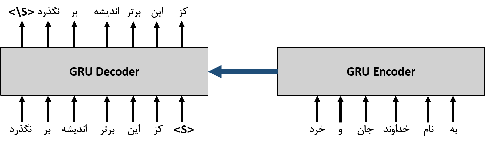

## Neural Persian Poet: A sequence-to-sequence model for composing Persian poetry
Persian poetry has a very old history. This old history owes to great poets such as Ferdowsi (فردوسی), Hafez (حافظ), Khayyam (خیام), Saadi (سعدی), Rudaki (رودکی) and Atar Neishabour (عطار نیشابوری). All these poets have composed poems in various formats with their inherent talent. In this project, we have tried to train a neural model to compose Persian poems in the same formats for us by taking inspiration from the poems composed by these poets in various formats. 


### Model architecture


To compose a poem in this project, a hemistich is used as a context. The reason for this is that the model used here is a sequence-to-sequence model.

As an example, we give the following hemistich as context to the network's encoder: 

به (/be/) نام (/nAm/) خداوند (/xodAvand/
) جان (/jAn/) و (/va/) خرد (/xerad/)

<br>And we expect the model to give us the following output:<br>

کز (/kaz/) این (/~in/) برتر (/bartar/) اندیشه (/~andiSe/) بر (/bar/) نگذرد (/nagzarad/)


### Installation
We provide instructions how to install dependencies via  pip.
First, clone the repository locally:

```
git clone https://github.com/HRSadeghi/NeuralPersianPoet.git
```

Change the current directory to NeuralPersianPoet:
```
cd NeuralPersianPoet
```

Now, prepare environment:
```
pip install -r requirements.txt
```


### Data Preparation

In this project, the ganjoor dataset is used, which includes ancient and contemporary Persian poems. All these poems are available online at [ganjoor website](https://ganjoor.net/). All information related to poems, poets, type of the poems etc. has been collected in a SQL database. In order to be able to use this data, we have collected the important information of this database in the form of a .csv dataset. You can download this dataset from [here](https://drive.google.com/drive/folders/1ZdB8A6i_y5LUaAFSy96GZdkM9o8Stipm?usp=sharing).

After adding the dataset directory, we expect the structure of the project to be as follows:

```
NeuralPersianPoet
...
├── dataset
│   ├── ganjoor.csv
│   ├── poet_list_train.pickle
│   ├── poet_list_test.pickle
│   ├── poem_list_train.pickle
│   ├── poem_list_test.pickle
├── dataLoader
...
```

If you want to use the customized dataset, you can first convert your poems' file to the ganjoor.csv file format and place it in the dataset directory, and then run the following code snippet.

```python
from dataLoader.utils import load_file, save_file
from dataLoader.utils import get_poems_and_poets
from sklearn.model_selection import train_test_split

poem_list, poet_list  = get_poems_and_poets(path = "PATH/To/YOUR_CUSTOM_DATASET",
                                            cleaning = True,
                                            constrained_poets = ['poet1','poet2', ...]  # like ['حافظ','فردوسی']
                                            )

poem_list_train, poem_list_test, poet_list_train, poet_list_test = train_test_split(poem_list, poet_list, test_size=0.3, shuffle=False)

save_file(poem_list_train, 'dataset/poem_list_train.pickle')
save_file(poem_list_test, 'dataset/poem_list_test.pickle')
save_file(poet_list_train, 'dataset/poet_list_train.pickle')
save_file(poet_list_test, 'dataset/poet_list_test.pickle')
```

### Tokenizer Preparation
Like the GPT model, Byte Pair Encoding (BPE) Tokenizer is used here to tokenize the poems. To use this tokenization, we need to train it. The tokenizer is trained with 30,000 tokens with a maximum length of 10 per each token. You can download the trained tokenizer from [here](https://drive.google.com/file/d/11SGCANSgxdzkHW4swPZKtav9DwW8VykO/view?usp=sharing). By downloading the bpe_tokenization.pkl file and placing it in the tokenization directory, the directory structure will be as follows:

```
NeuralPersianPoet
├── tokenization
│   ├── bpe_tokenization.py
│   ├── bpe_tokenization.pkl
│   ├── __init__.py
├── saved_model
...
```
If you plan to train your own tokenizer, you can use the following code snippet:
```python
from tokenization.bpe_tokenization import BPE_Tokenization
from dataLoader.utils import save_file
bpet = BPE_Tokenization(poem_list_train,
                            extra_tokens= ["__spm", "__epm", "__she", "__ehe1", "__ehe2", "__pad"],  
                            num_tokens = 30000,
                            ngram_max = 10)

save_file(bpet, 'tokenization/bpe_tokenization.pkl')
```


### Training

Training of the model 

### Inference

```
python inference.py 
```

